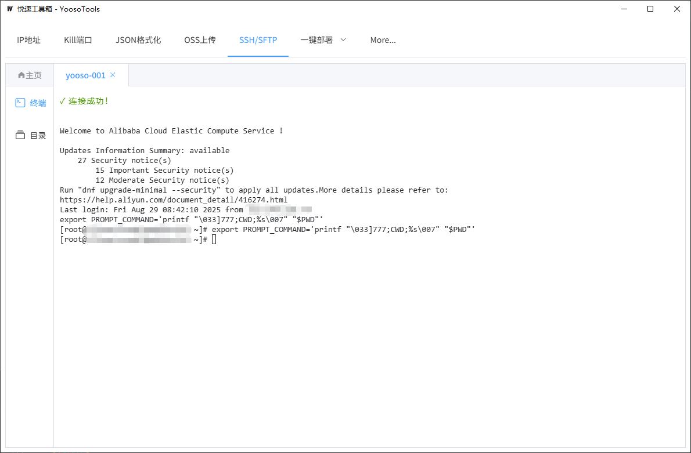

# YoosoTools
> 专为开发者打造的「瑞士军刀」式桌面工具
> 集

## 🧩 一句话简介
把日常最琐碎、最容易踩坑的运维 / 开发操作，全部做成“点一下就好”的图形化小工具。

---

## 🧩 软件截图展示

定制版信息

---

## 📦 当前功能速览

| 菜单 | 功能模块 | 一句话说明                                                   |
| --- | --- |---------------------------------------------------------|
| **IP地址** | MyIP | 实时显示本机网卡的 IPv4 / 公网的 IPv4 地址，一键复制到剪贴板。广播功能实现局域网IP掌握     |
| **Kill端口** | KillPort | 输入端口号 → 一键杀掉占用进程；支持 Windows / macOS / Linux。            |
| **JSON格式化** | JsonParse | 粘贴或上传 JSON → 自动格式化、对比、折叠、校验，支持下载。                       |
| **OSS上传** | OssUpload | 拖拽文件即可直传到阿里云 OSS，自动生成带外链。(需下载源码修改阿里云子账户id和key)          |
| **SSH/SFTP** | Linux | 内置终端 + SFTP 文件树；保存常用主机，一键登录，支持密钥 / 密码。                  |
| **一键部署** | BuildCloud | 针对 `your-project` 项目：修改profiles分支 → 一键打包上传部署 → 多节点滚动发布。 |
| **More...** | More | 快捷跳转到 GitHub / Element-Plus文档 / 问题反馈，后续新模块的入口。          |

---

## 🚀 典型场景

| 场景 | 传统做法 | YoosoTools 做法 |
| --- | --- | --- |
| 本地 3000 端口被占用 | `lsof ‑i:3000` → `kill ‑9 PID` | 打开 KillPort → 输入 3000 → 点一下 |
| 查看本机在局域网 IP | `ipconfig`/`ifconfig` 翻半天 | 打开 MyIP → 复制即用 |
| 格式化后端返回的 2MB JSON | 找在线网站 / IDE 插件 | 打开 JsonParse → 粘贴 → 自动格式化 |
| 把构建产物传 OSS | 登录控制台 → 创建目录 → 上传 | 打开 OssUpload → 拖拽 → 得到外链 |
| 紧急热修线上服务 | 打开终端 → ssh → 敲命令 | 打开 SSH/SFTP → 选择主机 → 一键登录 |

---

## 🔮 下一步计划（Roadmap）

- [ ] 一键生成 Nginx 配置
- [ ] Docker 镜像构建 & 推送
- [ ] 日志关键字实时高亮检索
- [ ] More...

---

## 📦 技术栈

- **前端**：Vue3 + Element-Plus
- **打包**：基于 Go 语言的 Wails 框架，将 Vue3 前端与 Go 后端编译为轻量级原生桌面应用
- **通信**：Go 后端通过 Wails 运行时与 Vue3 前端双向调用（IPC + WebSocket），并直接复用 Go 标准库 / golang.org/x/crypto/ssh 实现端口查杀、SSH/SFTP 等系统级操作
- **部署**：利用 Wails 的交叉编译能力，在 GitHub Actions 中一键生成 Windows / macOS / Linux 三平台可执行文件，并自动推送 Release 与 Homebrew Tap，无需额外容器,运行环境, Node 运行时。

---

## 🚀 安装 | 运行 | 打包

| 步骤 | 指令 / 操作 | 说明 |
| --- | --- | --- |
| **安装 Go** | 下载 [go1.25.0.windows-amd64.msi](https://dl.google.com/go/go1.25.0.windows-amd64.msi) → 双击安装 → 重开终端 | 确保 `GOPATH/bin` 已自动加入系统 PATH |
| **配置国内镜像** | `go env -w GOPROXY=https://goproxy.cn,direct` | 拉包飞快 |
| **安装 Wails CLI** | `go install github.com/wailsapp/wails/v2/cmd/wails@latest` | 装完后重启终端，让 `wails` 命令生效 |
| **一键运行** | `wails dev` | 热编译 + 前端 HMR，浏览器会自动打开调试窗口 |
| **一键打包** | `wails build` | 默认生成当前平台的可执行文件；加 `-platform windows/amd64,darwin/arm64,linux/amd64` 可一次性交叉编译三平台 |
| **产物位置** | `./build/bin/` | 直接双击即可运行，无需额外运行时或依赖 |
| **自动发布（可选）** | GitHub Actions 已内置：push Tag `v*` → Release + Homebrew Tap 自动完成 | 开箱即用，零配置 |

> Windows 首次打包若缺失 WebView2，Wails 会自动弹出安装提示，一键下一步即可。

---

## 💬 反馈 & 贡献

发现 bug 或想要新功能？  
直接在 GitHub 提 [Issue](https://github.com/yoosobyte/YoosoTools/issues) 或加群吹水，PR 更加欢迎！